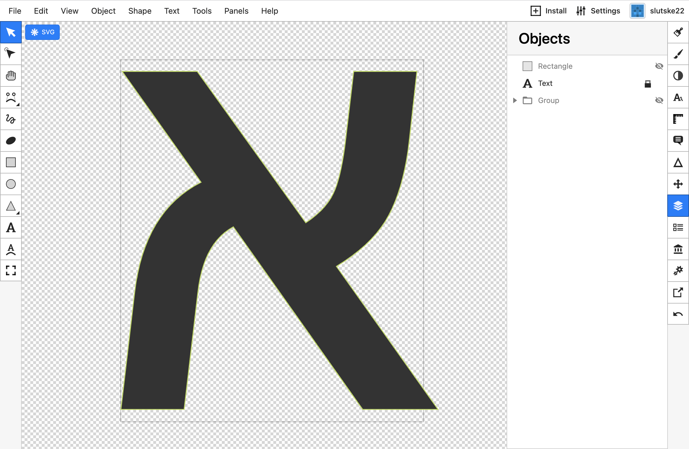
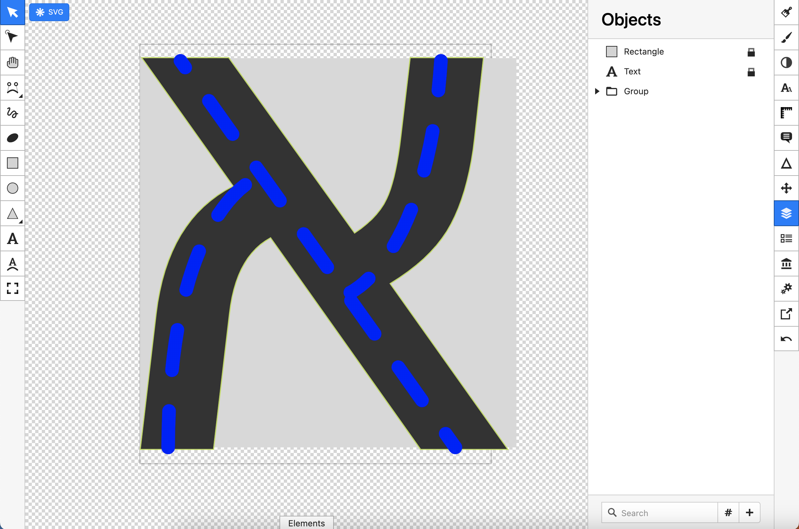
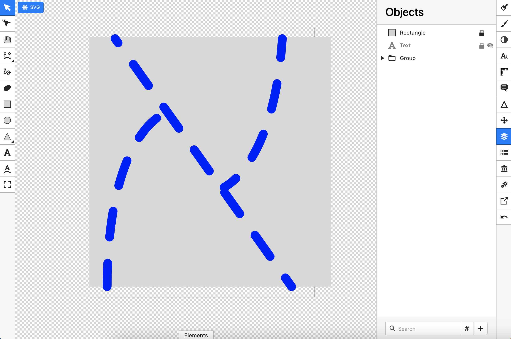
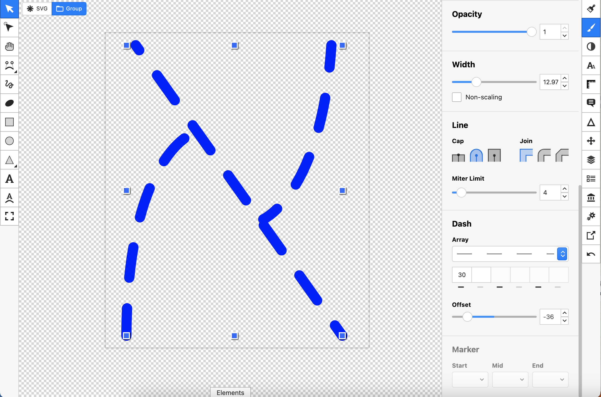
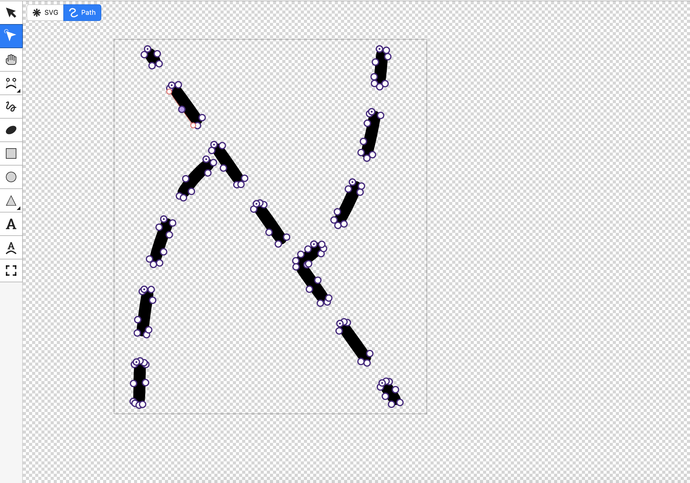
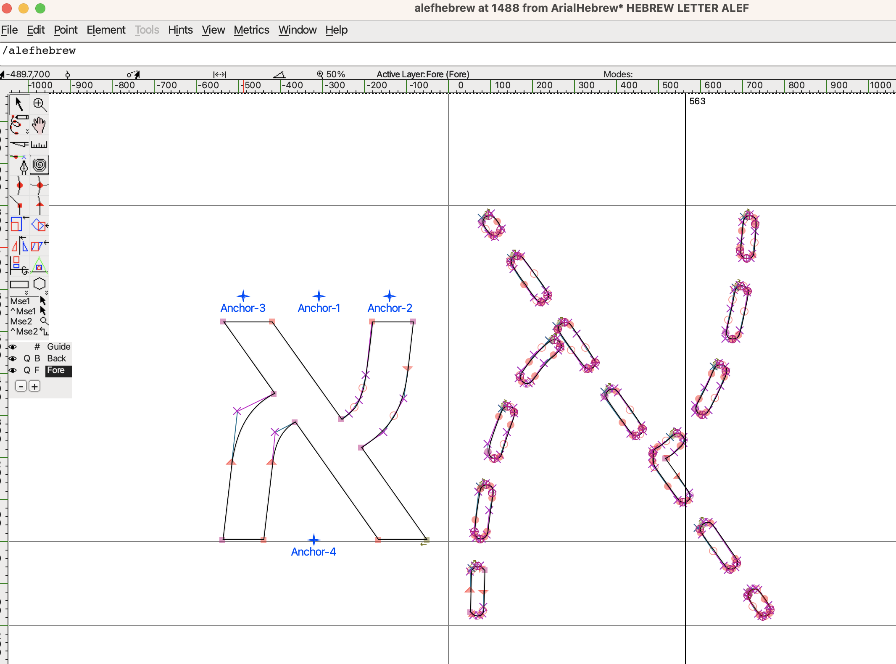
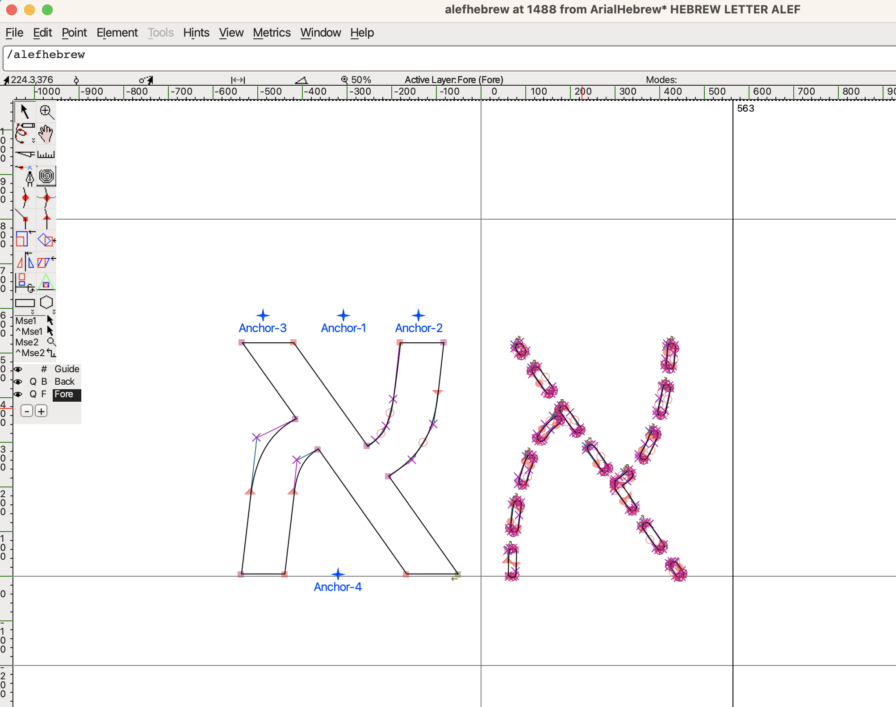
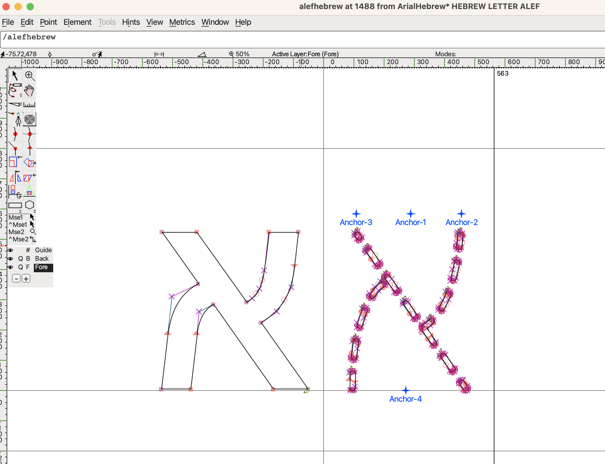

# Custom Fonts

## Process

The process of creating the custom fonts followed these steps

### Drawing the characters

In Boxy SVG (SVG web editor), create a text item with a hebrew character. The original font used was Cousine Regular, with some glyphs traced from Arial Hebrew system font (default hebrew font for mac). Then, using the layers and drawing controls, create an SVG of the letter with simple line and spline strokes. Use the dash array propety of the stroke panel to create the dotted line effect:





Remove the original character, and adjust the SVG and dash array offset so that the ends of the strokes align properly to the top, bottom, and other strokes:





### SVG-processing

Font creation software does not recognize `dash-array` svg properties. The SVG must be processed so that each dash within a stroke is its own SVG path. To make this transformation, `oslllo-svg-fixer` is used.

```
node node_modules/oslllo-svg-fixer/src/cli.js --s ./fonts/original -d ./fonts/processed
```

The result looks like this:



### Import into FontForge

Make a copy of the original font file. Open in FontForge. Find the hebrew characters, and click into the character being created. The generated SCGs are then [https://fontforge.org/docs/tutorial/importexample.html](imported into FontForge):



Using the svgs in the repo, we need to scale down the graphic by 55%. Adjust the positioning of the SVG and the anchors to match the original character





Save the character.

Go through this process for all characters, then exportthe font to a more common format, i.e. .woff
